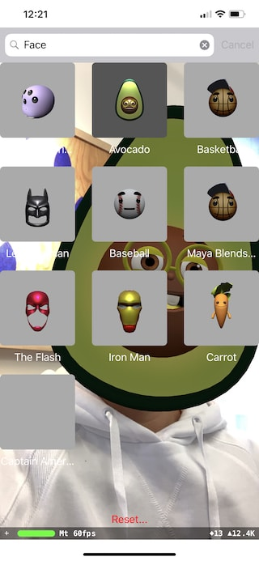
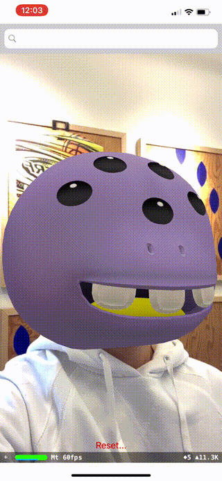

# ARKit Face Filters using the SVRF API

This example uses the [SVRF API][Docs] to create a Face Filter iOS App using [ARKit][]. In this example, users can search for [SVRF][] Face Filters and experience them using their front-facing TrueDepth camera.

 

## About ARKit

[ARKit][] on iPhone X and newer uses the front-facing TrueDepth camera to provide real-time information about the pose and expression of the user's face.

## SVRF + ARKit

Using ARKit's face detection and the SVRF API, you can apply 3D face filters to a user's face that react to their facial expressions in real-time. SVRF's 3D face filters are streamed to the device at runtime giving your users access to the entire SVRF library of face filters.

## Requirements

- [Xcode 10][Xcode]
- [CocoaPods][]
- iPhone X or newer with iOS 11+

## Get Started

Clone the repository and navigate to the example.

```bash
git clone https://github.com/SVRF/svrf-api.git && cd ./svrf-api/examples/ARKitFaceFilterDemo
```

Install the dependencies using [CocoaPods][].

```bash
pod install
```

Open `ARKitFaceFilterDemo.xcworkspace` in Xcode.

Configure [`./ARKitFaceFilterDemo/Plists/Info.plist`][Plist] with your **SVRF_API_KEY**. You can learn more about acquiring an API key at [developers.svrf.com][Docs].

```plist
<plist version="1.0">
  <dict>
    <key>SVRF_API_KEY</key>
    <string>{your-api-key}</string>
    <!-- ... -->
  </dict>
</plist>
```

To build and test the app, connect an iPhone X or newer and run the app.

[ARKit]: https://developer.apple.com/arkit/
[CocoaPods]: https://cocoapods.org/
[Docs]: https://developers.svrf.com
[Plist]: ./ARKitFaceFilterDemo/Plists/Info.plist
[SVRF]: https://www.svrf.com
[Xcode]: https://developer.apple.com/xcode/