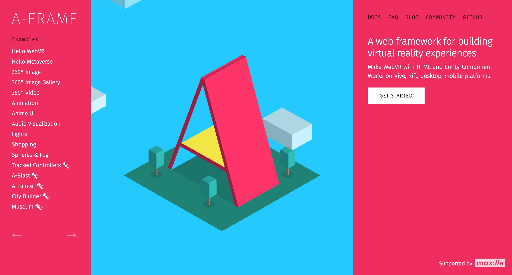

# A-Frame 360º Image Gallery using the SVRF API


This example uses the [SVRF API][Docs] to create a WebVR 360º image gallery using the A-Frame library. In this example, users can explore trending [SVRF.com][SVRF] experiences in WebVR.

## About A-Frame



[A-Frame][] is a web framework for building virtual reality experiences. With A-Frame you can quickly create WebVR applications that work on VIVE, Rift, Daydream, Gear, and desktop. Head over to the [A-Frame Docs][] to learn more.

## Requirements

- [Node.js][]

## Get Started

Clone the repository and navigate to the example.

```bash
git clone https://github.com/SVRF/svrf-api.git && cd ./svrf-api/examples/a-frame
```

Install the dependencies using [NPM][].

```bash
npm install
```

Bundle the dependencies and watch for changes with the command:

```bash
npm start
```

You will need to provide your SVRF API Key in [`./src/svrf.js`](./src/svrf.js), line 8. You can learn more about acquiring an API key at [developers.svrf.com][Docs].

You view the example by opening [./index.html][Example].

[A-Frame]: https://aframe.io/
[A-Frame Docs]: https://aframe.io/docs/0.8.0/introduction/
[Docs]: https://developers.svrf.com
[Example]: ./index.html
[Node.js]: https://nodejs.org
[NPM]: https://www.npmjs.com
[SVRF]: https://www.svrf.com